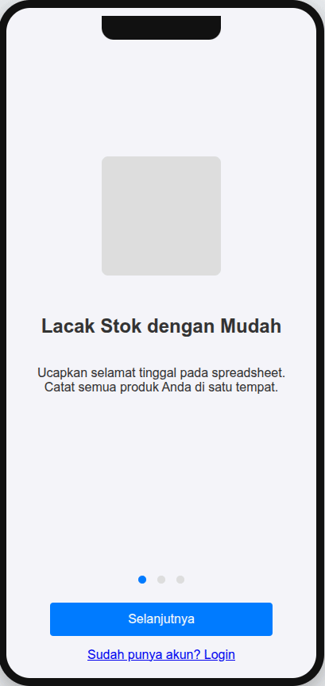

# Stokify - Manajemen Inventaris Modern


Aplikasi manajemen inventaris modern yang mobile-first, dirancang untuk memberdayakan Usaha Kecil dan Menengah (UKM) di Indonesia. Dibangun dengan Flutter, PocketBase, dan Riverpod.

---

### Tampilan Aplikasi (Prototipe Hi-Fi)


### 📚 Daftar Isi
1. [Tentang Proyek](#🌟-tentang-proyek)
2. [Fitur Utama](#✨-fitur-utama)
3. [Teknologi Stack](#🛠️-teknologi-stack)
4. [Arsitektur Proyek](#🏗️-arsitektur-proyek)
5. [Memulai Proyek (Getting Started)](#⚙️-memulai-proyek-getting-started)
6. [Prototipe Interaktif](#🎨-prototipe-interaktif)
7. [Roadmap Pengembangan](#🗺️-roadmap-pengembangan)
8. [Lisensi](#📄-lisensi)
9. [Kontak](#📫-kontak)

---

### 🌟 Tentang Proyek

**Stokify** lahir dari kebutuhan UKM untuk beralih dari pencatatan stok manual yang rentan kesalahan ke sistem digital yang efisien dan akurat. Aplikasi ini dirancang untuk menjadi solusi yang intuitif dan terjangkau, memungkinkan pemilik bisnis untuk:
*   Mengetahui jumlah stok secara *real-time*.
*   Melacak setiap barang yang masuk dan keluar.
*   Mengelola inventaris dari beberapa cabang.
*   Berkolaborasi dengan tim dengan peran yang berbeda.

Proyek ini dibangun dengan model bisnis **Freemium**, menawarkan fungsionalitas inti secara gratis dan fitur-fitur canggih untuk bisnis yang sedang berkembang melalui langganan Premium.

### ✨ Fitur Utama

#### Paket Free (Individual)
*   **Manajemen Produk:** CRUD untuk produk dan kategori.
*   **Stok Editing Langsung:** Update jumlah stok secara manual dengan cepat.
*   **Scanner Barcode:** Gunakan kamera untuk mencari atau menambah produk.
*   **Single-User & Single-Branch:** Didesain untuk pemilik usaha tunggal.

#### 🚀 Fitur Premium (Business)
*   **Sistem Transaksi:** Catat setiap **Barang Masuk** dan **Barang Keluar** secara terpisah.
*   **Riwayat & Kartu Stok:** Lacak setiap perubahan stok secara detail, termasuk siapa dan kapan.
*   **Manajemen Tim:** Undang anggota tim dengan peran **Admin** atau **Staf**.
*   **Multi-Cabang:** Kelola stok di beberapa toko atau gudang dari satu akun.
*   **Filter Lanjutan:** Filter produk berdasarkan kategori dan cabang secara bersamaan.
*   **Ekspor Data:** Ekspor data inventaris ke format CSV.

### 🛠️ Teknologi Stack

*   **Frontend:** [Flutter](https://flutter.dev/) - Untuk aplikasi cross-platform (iOS & Android) yang indah dan cepat.
*   **State Management:** [Riverpod](https://riverpod.dev/) (dengan Riverpod Generator) - Untuk state management yang modern, aman, dan mudah di-test.
*   **Backend:** [PocketBase](https://pocketbase.io/) - Sebagai backend *all-in-one*: database, autentikasi, API real-time, dan penyimpanan file.
*   **Logika Backend Tambahan:** JavaScript (via PocketBase Hooks) - Untuk otomatisasi update stok.
*   **Prototyping:** HTML, CSS, JavaScript - Untuk visualisasi alur Lo-Fi & Hi-Fi.

### 🏗️ Arsitektur Proyek

Proyek ini menggunakan **Arsitektur Berbasis Fitur (Feature-First)**, yang merupakan adaptasi dari *Clean Architecture*. Ini membuat kode terorganisir, skalabel, dan mudah dikelola.

Struktur di dalam setiap fitur dipisahkan menjadi beberapa lapisan:
*   `presentation/`: Semua yang berhubungan dengan UI (screens, widgets).
*   `application/`: Logika bisnis dan state management (Riverpod Providers).
*   `data/`: Repository yang berkomunikasi dengan sumber data (PocketBase API).
*   `domain/`: Model data murni (Plain Dart Objects).

---

### ⚙️ Memulai Proyek (Getting Started)

Untuk menjalankan proyek ini di lingkungan lokal Anda, ikuti langkah-langkah berikut.

#### Prasyarat
*   [Flutter SDK](https://flutter.dev/docs/get-started/install) (versi 3.x atau lebih baru)
*   [PocketBase Executable](https://pocketbase.io/docs/)

#### 1. Setup Backend (PocketBase)
1.  Unduh executable PocketBase yang sesuai dengan OS Anda.
2.  Jalankan PocketBase dengan perintah: `./pocketbase serve`
3.  Akses Admin UI di `http://127.0.0.1:8090/_/`.
4.  Buat akun admin pertama Anda.
5.  Buat *collections* (`perusahaan`, `cabang`, `produk`, `transaksi_stok`, dll.) sesuai dengan skema yang didefinisikan dalam [SRS](link-to-your-srs-if-any).
6.  (Untuk Fitur Premium) Buat file `pb_hooks/updateStok.js` dan salin kode hook yang diperlukan untuk otomatisasi stok.

#### 2. Setup Frontend (Flutter)
1.  Clone repositori ini:
    ```sh
    git clone https://github.com/Ezhar-Digital/stokify_app.git
    ```
2.  Buka proyek di editor kode Anda (seperti VS Code).
3.  Pastikan koneksi PocketBase di dalam kode (biasanya di `lib/core/api/pocketbase_client.dart`) mengarah ke instance lokal Anda:
    ```dart
    final pb = PocketBase('http://127.0.0.1:8090');
    ```
4.  Dapatkan semua dependensi:
    ```sh
    flutter pub get
    ```
5.  Jalankan aplikasi:
    ```sh
    flutter run
    ```

### 🎨 Prototipe Interaktif

Sebelum memulai coding, proyek ini dirancang melalui prototipe Hi-Fi interaktif menggunakan HTML, CSS, dan JavaScript. Anda dapat mencobanya untuk memahami alur aplikasi secara penuh.

*   **Link Prototipe:** [Coba Prototipe Stokify Di Sini](link-to-your-prototype-hosted-on-vercel-or-github-pages)
*   **Fitur Simulasi:** Di bagian bawah layar prototipe, terdapat *toggle switch* untuk beralih antara tampilan **Pengguna Free** dan **Pengguna Premium** untuk melihat perbedaan fitur secara langsung.

### 🗺️ Roadmap Pengembangan

Berikut adalah beberapa fitur yang direncanakan untuk versi mendatang setelah v1.0:
*   [ ] Dashboard analitik yang lebih mendalam.
*   [ ] Integrasi dengan platform e-commerce (Shopify, Tokopedia).
*   [ ] Manajemen supplier dan *purchase order*.
*   [ ] Notifikasi untuk stok yang hampir habis.
*   [ ] Valuasi inventaris berdasarkan harga pokok.

### 📄 Lisensi

Copyright (c) 2005 Akhmad Khanif Zyen. All Rights Reserved.

Perangkat lunak ini adalah properti dari Akhmad Khanif Zyen dan dilindungi oleh undang-undang hak cipta.

Anda **tidak diizinkan** untuk:
- Menyalin, memodifikasi, menggabungkan, mempublikasikan, atau mendistribusikan kode sumber ini.
- Melakukan sublisensi dan/atau menjual salinan Perangkat Lunak.
- Melakukan rekayasa balik (*reverse engineering*), dekompilasi, atau membongkar Perangkat Lunak.

Penggunaan yang tidak sah atas perangkat lunak ini akan mengakibatkan tuntutan hukum.

### 📫 Kontak

Akhmad Khanif Zyen - [@khanifzyen](https://threads.com/khanifzyen) - khanif.zyen@gmail.com

Link Proyek: [https://github.com/Ezhar-Digital/stokify_app](https://github.com/Ezhar-Digital/stokify_app)